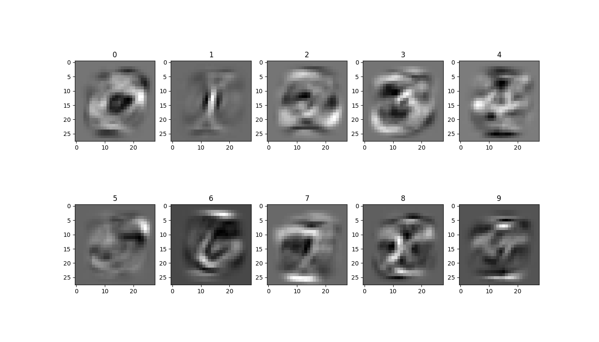

# Neural Networks

This project is designed to show the differences between several neural networks being trained on the same dataset. 
In it's current version the code runs on the MNIST dataset of handwritten digits. It runs three neural networks on the dataset: 
  - A single layer neural network (~86% accuracy) where each digit has its own set of weights, this is interesting to see the final weights that the neural network learns:
  
  - A multi-layer feed forward neural network with two dense layers. This network is able to achieve ~97% accuracy.
  - A convolutional neural network with two convolutional layers of convolution and max pooling, followed by a dense layer. This network is able to achieve ~98.5% accuracy.
  
## Installation Instructions
**IMPORTANT:** Tensorflow only works with Python 3.6 - 3.8.
- Create a virtualenv on Windows using:
    - `python -m virtualenv venv`
    - `.\venv\Scripts\activate`
- Install necessary dependencies using:
    - `pip install -r requirements.txt`
- Run the code by typing:
    - `python neural_network.py`

Note: The number of epochs can be changed in utils.py by editing the NUM_EPOCHS constant.
